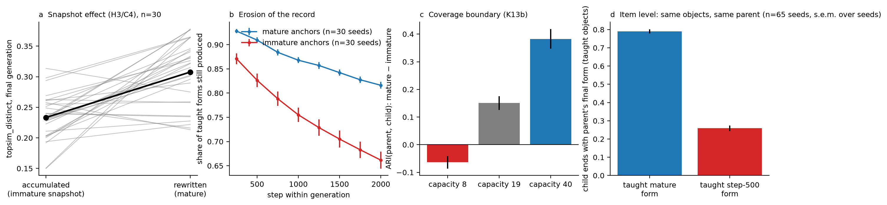

# Why This Language? Historical Symmetry Breaking through Cultural Transmission

[](https://doi.org/10.5281/zenodo.22338453)
[](https://doi.org/10.5281/zenodo.22338797)
[](https://orcid.org/0009-0001-1341-366X)
[](https://github.com/lgboim/why-this-language-historical-symmetry-breaking-through-cultural-transmission/actions/workflows/repository-quality.yml)
[](LICENSE-CODE.txt)
[](LICENSE-DOCUMENTATION-DATA.txt)

Research software, manuscript, pre-registrations and replication materials for:

> Ariel Elboim (2026), *Why This Language? Historical Symmetry Breaking through Cultural Transmission*. Working paper, Version 2.0.

The paper studies a minimal controlled model of cultural transmission. Two small neural agents play a Lewis referential game over 64 objects and invent a language; each generation is a fresh pair that first learns a limited set of its parent's (object, message) pairs from a persistent record and then trains on the game. When many structured languages are available to independent learners, a limited transmitted record breaks the symmetry among them: descendants converge on a shared, historically contingent reconstruction despite substantial item-level turnover. The record also carries the developmental state in which it was captured (the Snapshot Effect). This is a toy world, not a model of human language; every claim is scoped in the manuscript.

**Paper:** [Zenodo 10.5281/zenodo.22338453](https://doi.org/10.5281/zenodo.22338453) (Version 2.0; [all versions](https://doi.org/10.5281/zenodo.22305642)) · **archived code and results:** [Zenodo 10.5281/zenodo.22338797](https://doi.org/10.5281/zenodo.22338797) (Version 2.0.0; [all versions](https://doi.org/10.5281/zenodo.22305563)) · **author:** [ORCID 0009-0001-1341-366X](https://orcid.org/0009-0001-1341-366X)

Version 2.0 (5 September 2026) corrects Version 1.0 after an independent data verification. Zenodo holds the citable, immutable archives. This GitHub repository is the maintained working view and will carry documented corrections and later releases.

## What the study finds

Two learners taught from the same record end up with languages whose meaning partitions agree far more than two learners taught from different records of the same parent, and far more than independent learners (adjusted Rand index 0.46 against 0.25 and 0.11 in the confirmation cohort; pre-registered K16, replicated on untouched seeds). The strength of coordination and its target come apart: anchors captured from an immature snapshot of the parent's language steer descendants toward the immature organisation. A child taught an object's mature form ends with the parent's final form 79% of the time; taught the step-500 form, 26% (Figure 4d, 65 seeds). In the main GRU learner this occurs without a detectable weakening of coordination under a pre-specified criterion, but at a cost to systematicity. A second architecture and a minimal reconstruction model recover the same symmetry-breaking and provenance-target pattern.



Every pre-registered outcome is reported, including the ones that failed: the registered capacity-coverage subgroup (K12) does not replicate equivalence, the second architecture does not meet the no-material-weakening band (A4), and the reconstruction model's persistence condition (T4) does not reproduce the neural result. The full ledger is in the Supplement, Tables S1 to S4.

## Repository map

| Path | Purpose |
| --- | --- |
| [`paper/`](paper/) | Version 2.0 PDFs (article, supplement, combined, revision notes) and their Markdown sources |
| [`figures/`](figures/) | The four publication figures (PNG and PDF) and `figure_stats.json` with every plotted statistic |
| [`replication/`](replication/) | Simulation code, evaluators, pre-registrations with frozen thresholds, verdict reports, saved evaluator inputs, and the Version 2 correction audit trail (`corrections_v2/`) |
| [`replication/CHANGELOG_v2.md`](replication/CHANGELOG_v2.md) | Every verdict, number, wording and code change between Version 1.0 and Version 2.0, with reasons |
| [`verification/`](verification/) | The independent data verification of 5 September 2026 that triggered Version 2.0 (report, evidence, recomputed values) |
| [`public_manifest.json`](public_manifest.json) | SHA-256 inventory of every file in this repository |
| [`REPRODUCIBILITY.md`](REPRODUCIBILITY.md) | What can be re-scored from the shipped files, what needs the full run set, and how to regenerate everything |
| [`CITATION.cff`](CITATION.cff), [`codemeta.json`](codemeta.json) | Machine-readable citation and research-software metadata |

## Quick verification

From the repository root, with Python 3.11 or later and the packages in `requirements.txt`:

```bash
python verify_manifest.py --check
python -m compileall -q replication
cd replication && python tests.py
```

The first command checks every file against the SHA-256 inventory. The third runs 31 checks of the world sampler, the tie-corrected Spearman, the record mechanics and the corrected adjusted Rand index (identical singleton partitions score 1). It needs PyTorch on the CPU and finishes in under a minute.

## Reproduce the analysis

Two things regenerate from scratch with no saved runs:

```bash
cd replication
python model_v2.py          # the reconstruction model: corrected T4 and the measured T2 move cost
```

The output is byte-identical to `replication/results_model/toy_results_v2.md`.

The pre-registered lineage and second-architecture evaluators (K14, K16, K17a to K17c, A1 to A4, M2, S1, D1) re-score from the saved evaluator inputs shipped here:

```bash
cd replication
python corrections_v2/rerun.py probe46.py
K_OUT=results_replicate K_SEEDS=100..119 python corrections_v2/rerun.py probe46.py
K_ARCH=gumbel K_OUT=results_arch K_SEEDS=100..119 python corrections_v2/rerun.py probe46.py
```

`rerun.py` redirects every write into `corrections_v2/recomputed/`, so the shipped reports are never overwritten; the regenerated files match them byte for byte. The per-seed run files behind the remaining tests (K8 to K13, K15, K18, M1, the entropy and long-horizon families) and behind `figures.py` total about 3 GB and are not in this repository; [`REPRODUCIBILITY.md`](REPRODUCIBILITY.md) says exactly which commands need them and how to regenerate them with `lab.py` and `replicate.py`, including the known limits of the replication driver.

## Research transparency

- Every threshold was frozen before the confirmation runs (`replication/results_*/PREREG.md`, `replication/manifest_k.json`); the supplement gives the registration timeline, including the one test (K18) added while the replication was running, before inspection.
- Version 1.0 was checked against the saved data by an independent verification on 5 September 2026 (`verification/`). Version 2.0 corrects an adjusted-Rand-index edge case shared by all local copies of the metric, reports K12 for its registered subgroup, reimplements T4 as registered, makes the seed the independent unit, and corrects one supplementary value, one figure statistic and all figure error bars. The core findings (K16, K17c, K13a, K15, K18, C4, A3′, A4′-target) are unchanged. Originals and re-scored reports sit side by side in `replication/corrections_v2/`.
- No neural network was retrained for Version 2.0. Every corrected number was recomputed from saved data with the corrected code or from the corrected reconstruction model.
- The study was designed, coded, run and written with generative AI tools under the direction of the author, who takes full responsibility for the result.

## Citation

Use GitHub's **Cite this repository** control, the metadata in [`CITATION.cff`](CITATION.cff), or cite the immutable Zenodo releases:

> Elboim, A. (2026). *Why This Language? Historical Symmetry Breaking through Cultural Transmission* (Version 2.0). Zenodo. https://doi.org/10.5281/zenodo.22338453

> Elboim, A. (2026). *Why This Language? Historical Symmetry Breaking through Cultural Transmission: code, pre-registrations, results and manuscript* (Version 2.0.0). Zenodo. https://doi.org/10.5281/zenodo.22338797

## Versioning and archival policy

- Zenodo Version 1.0 / 1.0.0 (4 September 2026) remains immutable as the first public release. It contains the errors documented in `replication/CHANGELOG_v2.md`.
- Zenodo Version 2.0 / 2.0.0 (5 September 2026) is the corrected release and the version to cite.
- GitHub changes are documented in [`CHANGELOG.md`](CHANGELOG.md). Substantive releases will use semantic version tags and GitHub Releases, and will be archived as new Zenodo versions under the same concept DOIs.

## Licenses

Original code is licensed under the [MIT License](LICENSE-CODE.txt). The manuscript, supplement, revision notes, documentation, figures, registrations and result tables are licensed under [CC BY 4.0](LICENSE-DOCUMENTATION-DATA.txt). The precise allocation is in [`LICENSE-SCOPE.md`](LICENSE-SCOPE.md).

## Questions and contributions

Reproduction questions and narrowly scoped corrections are welcome through GitHub Issues. See [`CONTRIBUTING.md`](CONTRIBUTING.md) and [`SECURITY.md`](SECURITY.md) before opening an issue or pull request.
